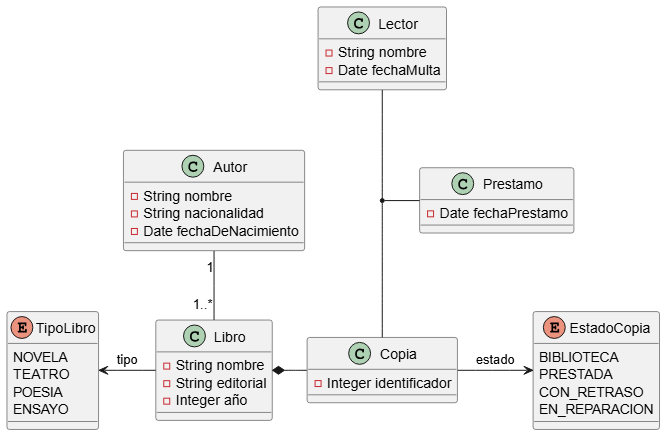

# Proyecto de ejemplo de Maven

## Proyecto: Gestión de biblioteca

- Una **biblioteca** _tiene_ **copias** de **libros**. Estos últimos se caracterizan por su **nombre**, **tipo** (novela, teatro, poesía, ensayo), **editorial**, **año** y **autor**.
- Los **autores** se caracterizan por su **nombre**, **nacionalidad** y **fecha de nacimiento**.
- Cada **copia** _tiene_ un **identificador**, y puede _estar_ en la **biblioteca**, **prestada**, **con retraso** o **en reparación**.
- Los **lectores** pueden _tener_ un máximo de 3 **libros** en **préstamo**.
- Cada **libro** se _presta_ un máximo de 30 días, por cada día de retraso, se _impone_ una **multa** de dos días sin posibilidad de _pedir_ un nuevo libro.

Realiza un diagrama de clases y añade los métodos necesarios para realizar el préstamo y devolución de libros.

## Modelo de datos

